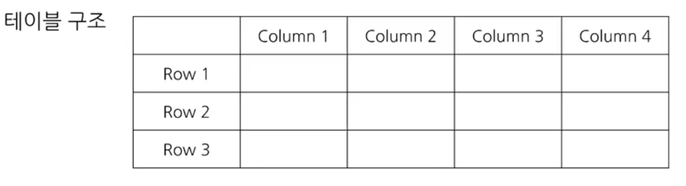
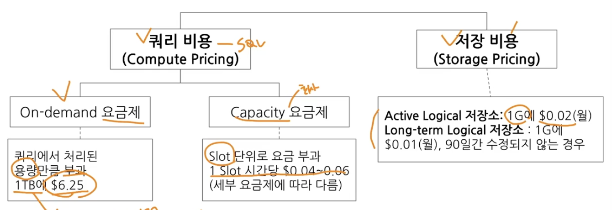

# 1-1. BigQuery 기초 지식

## 데이터 저장 형태

- 데이터는 보통 데이터베이스 테이블 등에 저장
    - Database : 데이터의 저장소
    - Table : 데이터가 저장된 공간
    - 저장된 데이터를 제품(앱, 웹)에서 사용
- 예시 : 음식 배달 서비스의 데이터 - 유저, 음식점, 음식, 라이더 등

## 데이터가 저장되는 장소

- MySQL, Oracle, PostgreSQL 같은 데이터베이스에 주로 저장

## MySQL, Oracle, PostgreSQL 같은 데이터베이스의 특징 => OLTP

- OLTP(Online Transaction Processing)
- 거래를 하기 위해 사용되는 데이터베이스
    - 보류, 궁간 상태가 없음 - 주문을 완료하거나 안하거나 : 데이터가 무결하다
    - 데이터의 추가(INSERT), 데이터의 변경(UPDATE)이 많이 발생

- SQL을 사용해 데이터를 추출할 수 있으나 분석을 위해 만든 데이터베이스가 아니라 쿼리 속도가 느릴 수 있음

## SQL(Structured Query Language)

- SQL : 데이터베이스에서 데이터를 가지고 올 때 사용하는 언어, 데이터베이스의 데이터를 관리하기 위해 설계된 특수 목적의 프로그래밍 언어

- 쿼리문, 쿼리 구문, 쿼리를 짠다. SQL 쿼리 등으로 표현

## 테이블에 저장된 데이터의 형태

- 행(Row) -> 새로운 row는 가로로 한 줄을 의미
    - 하나의 row가 하나의 고유한 데이터
    - 예 : 거래 History에서 하나의 row가 거래
    (주의) Raw 데이터 : 원본 데이터
---
- 열(Column) column은 원형 기둥이란 뜻, 세로로 연상
    - 각 데이터의 특정 속성 값
    - 거래의 구매 시간, 거래의 구매자
---
- 테이블에 저장된 형태 = 엑셀, 스프레드시트와 유사

## OLAP와 데이터 웨어하우스(DW)의 등장

- OLTP로 데이터 분석을 하다가 속도, 기능 부족의 이슈로 OLAP가 등장함
- OLAP : Online Analytical Processing
    - 분석을 위한 기능 제공

- 데이터 웨어하우스
    - 데이터를 한 곳에 모아서 저장
    - 여러 곳에 저장된 데이터 예시
        - Database, 웹(크롤링), 파일, API의 결과 등

## BigQuery 소개

- Google Cloud의 OLAP + Data Warehouse
- "Google Cloud의 데이터 웨어하우스"

## BigQuery 장점

1. 난이도
- SQL를 사용해 쉽게 데이터 추출 가능

2. 속도
- OLAP 도구이므로 속도가 빠름(단, 그만큼 돈을 지불)

3. Firebase, Google Analytics 4의 데이터를 쉽게 추출할 수 있음
- 사용 기기, 위치(시 단위까지 표현), OS 버전, 이벤트 행동 획득 가능(별도의 로깅 필요)

4. 데이터 웨어하우스를 사용하기 위해 서버(컴퓨터)를 띄울 필요 없음
- 구글에서 인프라를 관리함

## BigQuery를 사용하는 이유

- 회사에서 앱이나 웹에서 Firebase, Google Analytics 4를 활용할 경우
- 운영을 적은 비용(인력 등)으로 진행하기 위해
- 사용하는 회사 : 쏘카, 당근, 컬리, 하이퍼커넥트, 마이리얼트립, 버드뷰, 원티드랩, 매스프레소, 오피지지

## BigQuery 비용(US 기준)

---

# 1-2. BigQuery 환경 설정

## Google Cloud 설정