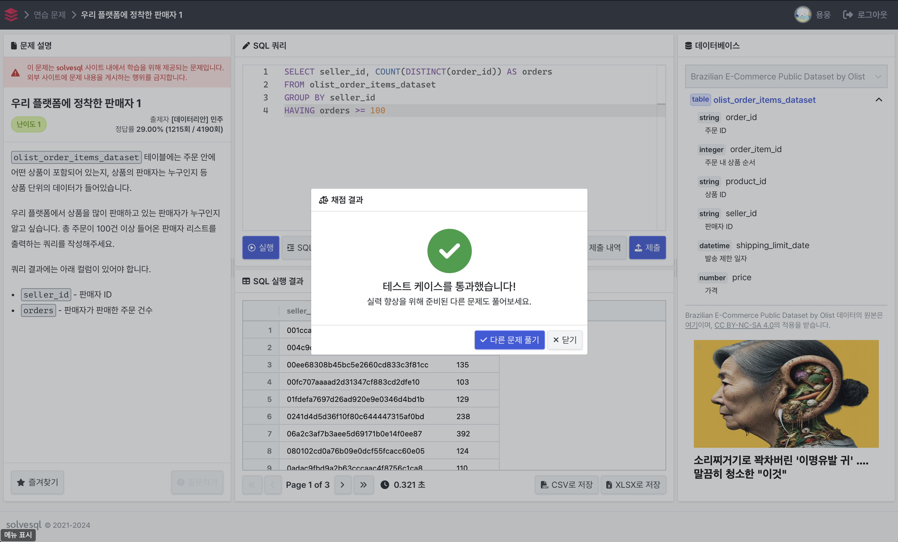
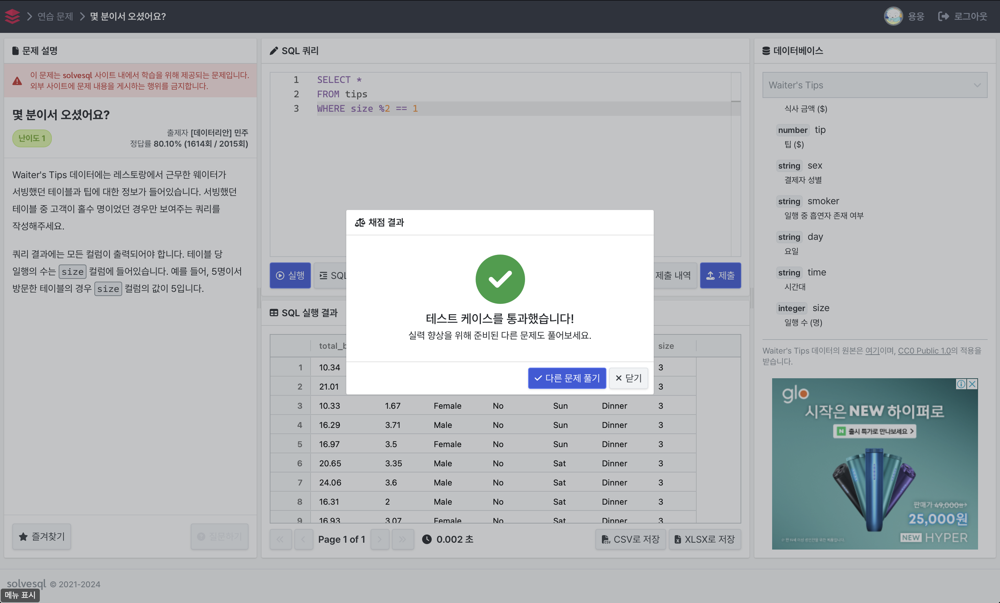

# 문제 1 (우리 플랫폼에 정착한 판매자 1)
```
olist_order_items_dataset 테이블에는 주문 안에 어떤 상품이 포함되어 있는지, 상품의 판매자는 누구인지 등 상품 단위의 데이터가 들어있습니다.

우리 플랫폼에서 상품을 많이 판매하고 있는 판매자가 누구인지 알고 싶습니다. 총 주문이 100건 이상 들어온 판매자 리스트를 출력하는 쿼리를 작성해주세요.

쿼리 결과에는 아래 컬럼이 있어야 합니다.

seller_id - 판매자 ID
orders - 판매자가 판매한 주문 건수
```
```SQL
SELECT seller_id, COUNT(DISTINCT(order_id)) AS orders
FROM olist_order_items_dataset
GROUP BY seller_id
HAVING orders >= 100
```


---

# 문제 2 (몇 분이서 오셨어요?)
```
Waiter's Tips 데이터에는 레스토랑에서 근무한 웨이터가 서빙했던 테이블과 팁에 대한 정보가 들어있습니다. 서빙했던 테이블 중 고객이 홀수 명이었던 경우만 보여주는 쿼리를 작성해주세요.

쿼리 결과에는 모든 컬럼이 출력되어야 합니다. 테이블 당 일행의 수는 size 컬럼에 들어있습니다. 예를 들어, 5명이서 방문한 테이블의 경우 size 컬럼의 값이 5입니다.
```
```SQL
SELECT *
FROM tips
WHERE size %2 == 1
```


---

# 문제 3 (최고의 근무일을 찾아라)
```
Waiter's Tips 데이터셋에는 식사 금액, 팁, 결제자 성별, 결제 요일 등 레스토랑 손님들의 계산 정보가 들어있습니다. 이 레스토랑에 근무하는 서버는 팁을 많이 받을 수 있는 날 하루를 골라 근무하고 싶습니다.

요일별로 팁 총액을 집계하고 팁이 가장 많았던 요일과 그날의 팁 총액을 출력하는 쿼리를 작성해주세요. 그날의 팁 총액은 소수점 셋째 자리에서 반올림하여 출력되도록 해주세요.

결과 데이터는 아래 컬럼을 포함해야 합니다.

day - 요일
tip_daily - 요일 별 팁 총액
```
```SQL
SELECT day, ROUND(SUM(tip), 2) AS tip_daily
FROM tips
GROUP BY day
ORDER BY tip_daily DESC
LIMIT 1
```
