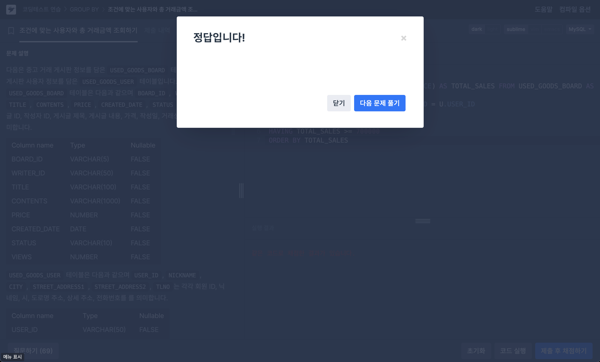
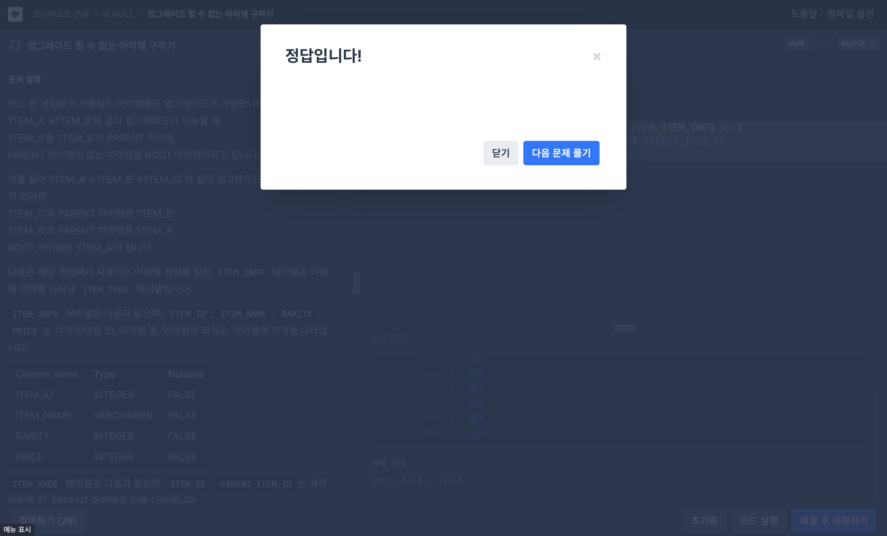

# 문제 1 (조건에 맞는 사용자와 총 거래금액 조회하기)
```
다음은 중고 거래 게시판 정보를 담은 USED_GOODS_BOARD 테이블과 중고 거래 게시판 사용자 정보를 담은 USED_GOODS_USER 테이블입니다. USED_GOODS_BOARD 테이블은 다음과 같으며 BOARD_ID, WRITER_ID, TITLE, CONTENTS, PRICE, CREATED_DATE, STATUS, VIEWS는 게시글 ID, 작성자 ID, 게시글 제목, 게시글 내용, 가격, 작성일, 거래상태, 조회수를 의미합니다.

USED_GOODS_USER 테이블은 다음과 같으며 USER_ID, NICKNAME, CITY, STREET_ADDRESS1, STREET_ADDRESS2, TLNO는 각각 회원 ID, 닉네임, 시, 도로명 주소, 상세 주소, 전화번호를 를 의미합니다.

문제
---
USED_GOODS_BOARD와 USED_GOODS_USER 테이블에서 완료된 중고 거래의 총금액이 70만 원 이상인 사람의 회원 ID, 닉네임, 총거래금액을 조회하는 SQL문을 작성해주세요. 결과는 총거래금액을 기준으로 오름차순 정렬해주세요.
```
```SQL
SELECT U.USER_ID, U.NICKNAME, SUM(B.PRICE) AS TOTAL_SALES FROM USED_GOODS_BOARD AS B
JOIN USED_GOODS_USER AS U ON B.WRITER_ID = U.USER_ID
WHERE B.STATUS = 'DONE'
GROUP BY U.USER_ID
HAVING TOTAL_SALES >= 700000
ORDER BY TOTAL_SALES
```


---

# 문제 2 (업그레이드 할 수 없는 아이템 구하기)
```
어느 한 게임에서 사용되는 아이템들은 업그레이드가 가능합니다.
'ITEM_A'->'ITEM_B'와 같이 업그레이드가 가능할 때
'ITEM_A'를 'ITEM_B'의 PARENT 아이템,
PARENT 아이템이 없는 아이템을 ROOT 아이템이라고 합니다.
예를 들어 'ITEM_A'->'ITEM_B'->'ITEM_C' 와 같이 업그레이드가 가능한 아이템이 있다면
'ITEM_C'의 PARENT 아이템은 'ITEM_B'
'ITEM_B'의 PARENT 아이템은 'ITEM_A'
ROOT 아이템은 'ITEM_A'가 됩니다.
다음은 해당 게임에서 사용되는 아이템 정보를 담은 ITEM_INFO 테이블과 아이템 관계를 나타낸 ITEM_TREE 테이블입니다.
ITEM_INFO 테이블은 다음과 같으며, ITEM_ID, ITEM_NAME, RARITY, PRICE는 각각 아이템 ID, 아이템 명, 아이템의 희귀도, 아이템의 가격을 나타냅니다.

ITEM_TREE 테이블은 다음과 같으며, ITEM_ID, PARENT_ITEM_ID는 각각 아이템 ID, PARENT 아이템의 ID를 나타냅니다.

단, 각 아이템들은 오직 하나의 PARENT 아이템 ID 를 가지며, ROOT 아이템의 PARENT 아이템 ID 는 NULL 입니다.
ROOT 아이템이 없는 경우는 존재하지 않습니다.

문제
---
더 이상 업그레이드할 수 없는 아이템의 아이템 ID(ITEM_ID), 아이템 명(ITEM_NAME), 아이템의 희귀도(RARITY)를 출력하는 SQL 문을 작성해 주세요. 이때 결과는 아이템 ID를 기준으로 내림차순 정렬해 주세요.
```
```SQL
SELECT I.ITEM_ID, I.ITEM_NAME, I.RARITY FROM ITEM_INFO AS I
LEFT JOIN ITEM_TREE AS T ON I.ITEM_ID = T.PARENT_ITEM_ID
WHERE T.PARENT_ITEM_ID IS NULL
ORDER BY ITEM_ID DESC
```


---

# 문제 3 (조건에 맞는 개발자 찾기)
```
SKILLCODES 테이블은 개발자들이 사용하는 프로그래밍 언어에 대한 정보를 담은 테이블입니다. SKILLCODES 테이블의 구조는 다음과 같으며, NAME, CATEGORY, CODE는 각각 스킬의 이름, 스킬의 범주, 스킬의 코드를 의미합니다. 스킬의 코드는 2진수로 표현했을 때 각 bit로 구분될 수 있도록 2의 제곱수로 구성되어 있습니다.

DEVELOPERS 테이블은 개발자들의 프로그래밍 스킬 정보를 담은 테이블입니다. DEVELOPERS 테이블의 구조는 다음과 같으며, ID, FIRST_NAME, LAST_NAME, EMAIL, SKILL_CODE는 각각 개발자의 ID, 이름, 성, 이메일, 스킬 코드를 의미합니다. SKILL_CODE 컬럼은 INTEGER 타입이고, 2진수로 표현했을 때 각 bit는 SKILLCODES 테이블의 코드를 의미합니다.

예를 들어 어떤 개발자의 SKILL_CODE가 400 (=b'110010000')이라면, 이는 SKILLCODES 테이블에서 CODE가 256 (=b'100000000'), 128 (=b'10000000'), 16 (=b'10000') 에 해당하는 스킬을 가졌다는 것을 의미합니다.

문제
---
DEVELOPERS 테이블에서 Python이나 C# 스킬을 가진 개발자의 정보를 조회하려 합니다. 조건에 맞는 개발자의 ID, 이메일, 이름, 성을 조회하는 SQL 문을 작성해 주세요.
결과는 ID를 기준으로 오름차순 정렬해 주세요.
```
```SQL
SELECT ID, EMAIL, FIRST_NAME, LAST_NAME FROM DEVELOPERS
WHERE SKILL_CODE & (SELECT SUM(CODE) FROM SKILLCODES WHERE NAME IN ('Python', 'C#')) != 0
ORDER BY ID
```
