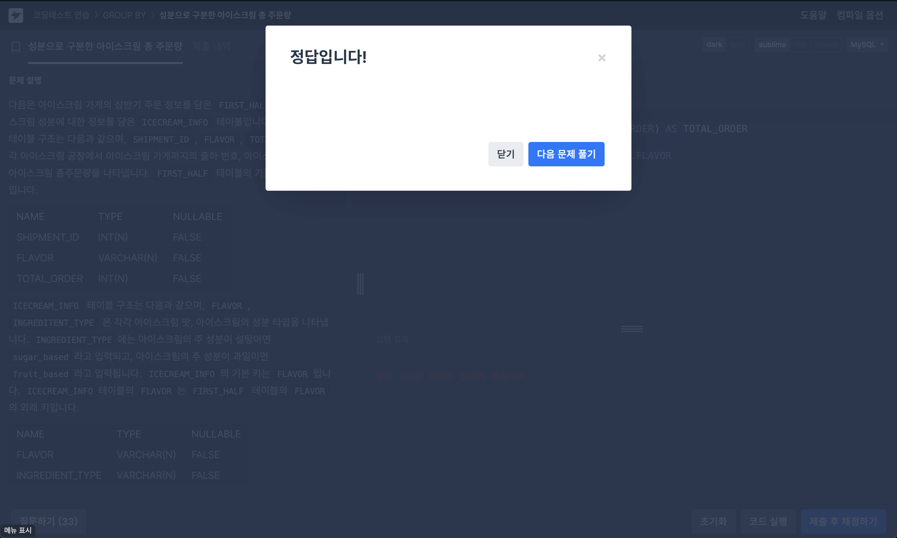
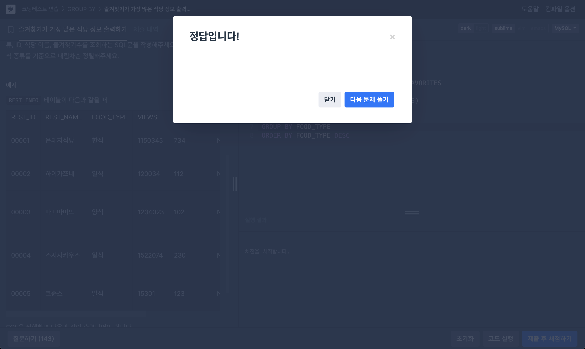
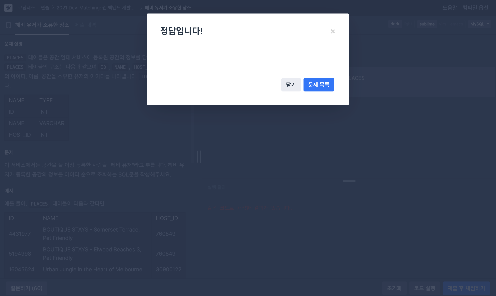

# 문제 1 (성분으로 구분한 아이스크림 총 주문량)
```
다음은 아이스크림 가게의 상반기 주문 정보를 담은 FIRST_HALF 테이블과 아이스크림 성분에 대한 정보를 담은 ICECREAM_INFO 테이블입니다. FIRST_HALF 테이블 구조는 다음과 같으며, SHIPMENT_ID, FLAVOR, TOTAL_ORDER 는 각각 아이스크림 공장에서 아이스크림 가게까지의 출하 번호, 아이스크림 맛, 상반기 아이스크림 총주문량을 나타냅니다. FIRST_HALF 테이블의 기본 키는 FLAVOR입니다.

ICECREAM_INFO 테이블 구조는 다음과 같으며, FLAVOR, INGREDITENT_TYPE 은 각각 아이스크림 맛, 아이스크림의 성분 타입을 나타냅니다. INGREDIENT_TYPE에는 아이스크림의 주 성분이 설탕이면 sugar_based라고 입력되고, 아이스크림의 주 성분이 과일이면 fruit_based라고 입력됩니다. ICECREAM_INFO의 기본 키는 FLAVOR입니다. ICECREAM_INFO테이블의 FLAVOR는 FIRST_HALF 테이블의 FLAVOR의 외래 키입니다.

문제
---
상반기 동안 각 아이스크림 성분 타입과 성분 타입에 대한 아이스크림의 총주문량을 총주문량이 작은 순서대로 조회하는 SQL 문을 작성해주세요. 이때 총주문량을 나타내는 컬럼명은 TOTAL_ORDER로 지정해주세요.
```
```SQL
SELECT B.INGREDIENT_TYPE, SUM(A.TOTAL_ORDER) AS TOTAL_ORDER
FROM FIRST_HALF AS A
JOIN ICECREAM_INFO AS B ON A.FLAVOR = B.FLAVOR
GROUP BY B.INGREDIENT_TYPE
ORDER BY TOTAL_ORDER ASC
```



---
# 문제 2 (즐겨찾기가 가장 많은 식당 정보 출력하기)
```
다음은 식당의 정보를 담은 REST_INFO 테이블입니다. REST_INFO 테이블은 다음과 같으며 REST_ID, REST_NAME, FOOD_TYPE, VIEWS, FAVORITES, PARKING_LOT, ADDRESS, TEL은 식당 ID, 식당 이름, 음식 종류, 조회수, 즐겨찾기수, 주차장 유무, 주소, 전화번호를 의미합니다.

문제
---
REST_INFO 테이블에서 음식종류별로 즐겨찾기수가 가장 많은 식당의 음식 종류, ID, 식당 이름, 즐겨찾기수를 조회하는 SQL문을 작성해주세요. 이때 결과는 음식 종류를 기준으로 내림차순 정렬해주세요.
```

```SQL
SELECT FOOD_TYPE, REST_ID, REST_NAME, FAVORITES
FROM REST_INFO
WHERE FAVORITES IN (SELECT MAX(FAVORITES)
                   FROM REST_INFO
                   GROUP BY FOOD_TYPE)
GROUP BY FOOD_TYPE
ORDER BY FOOD_TYPE DESC
```

```
GROUP BY 이후 HAVING으로 MAX(FAVORITES) 조건문을 작성하면 이미 GROUP BY가 되어있는 상태이기 때문에 조건이 적용되지 않는다.
따라서 WHERE절에서 MAX(FAVORITES) 조건을 써준 뒤 GROUP BY를 사용했다.
```



---
# 문제 3 (헤비 유저가 소유한 장소)
```
PLACES 테이블은 공간 임대 서비스에 등록된 공간의 정보를 담은 테이블입니다. PLACES 테이블의 구조는 다음과 같으며 ID, NAME, HOST_ID는 각각 공간의 아이디, 이름, 공간을 소유한 유저의 아이디를 나타냅니다. ID는 기본키입니다.

문제
---
이 서비스에서는 공간을 둘 이상 등록한 사람을 "헤비 유저"라고 부릅니다. 헤비 유저가 등록한 공간의 정보를 아이디 순으로 조회하는 SQL문을 작성해주세요.
```

```SQL
SELECT * FROM PLACES
WHERE HOST_ID IN (SELECT HOST_ID FROM PLACES
               GROUP BY HOST_ID
               HAVING COUNT(*) >= 2)
ORDER BY ID
```

