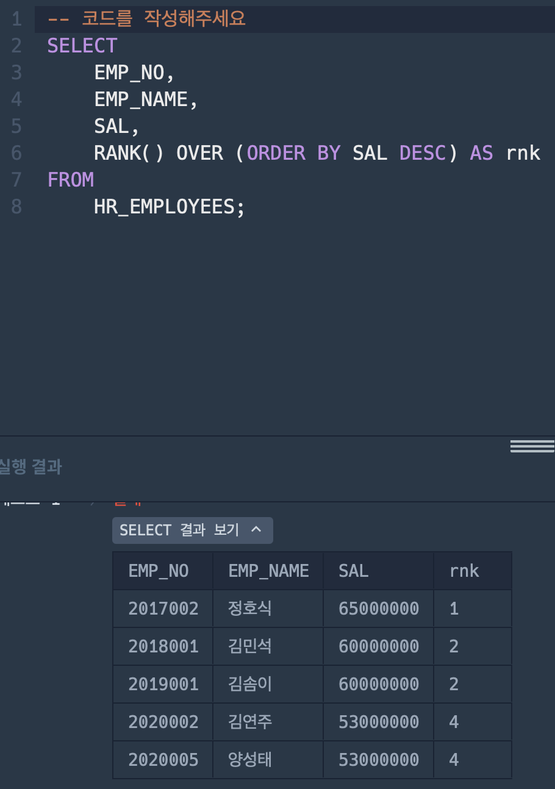
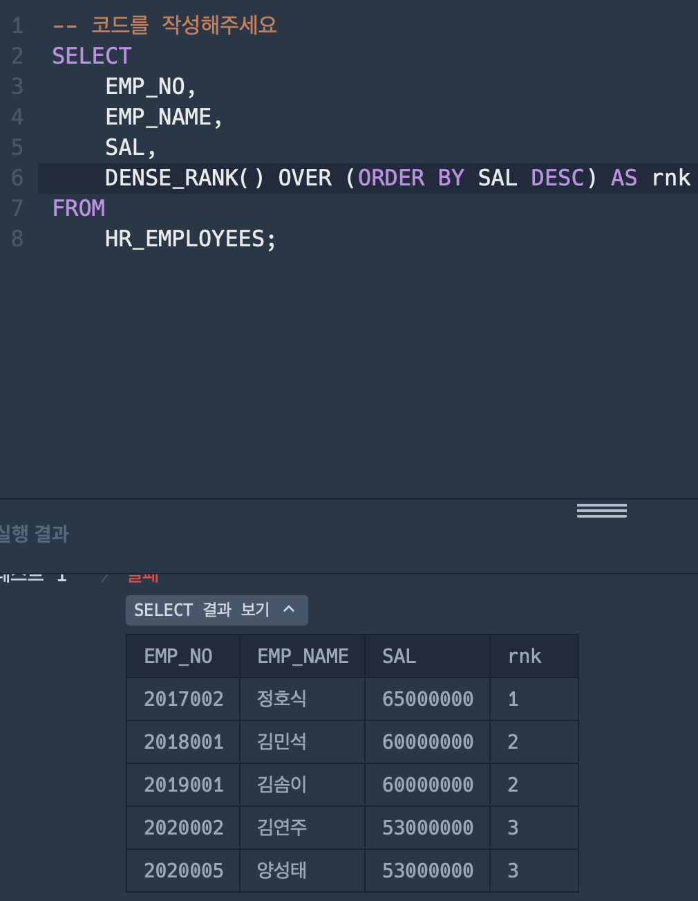
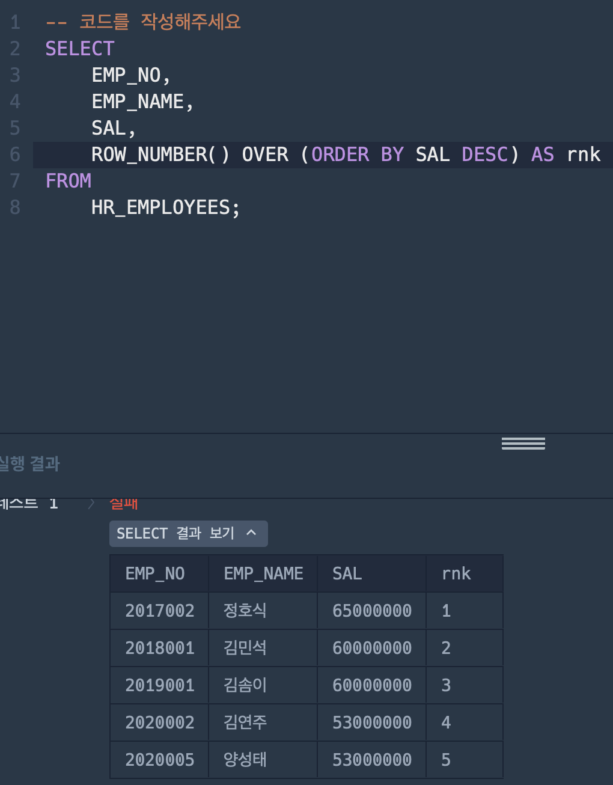

# 문제 1 (즐겨찾기가 가장 많은 식당 정보 출력하기)

```
문제 
---
REST_INFO 테이블에서 음식종류별로 즐겨찾기수가 가장 많은 식당의 음식 종류, ID, 식당 이름, 즐겨찾기수를 조회하는 SQL문을 작성해주세요. 이때 결과는 음식 종류를 기준으로 내림차순 정렬해주세요.
```

### 1. 틀린 코드 분석

**틀린 코드**

```SQL
SELECT *
FROM (SELECT FOOD_TYPE, REST_ID, REST_NAME, MAX(FAVORITES) AS FAVORITES
FROM REST_INFO
GROUP BY FOOD_TYPE ) R
ORDER BY FOOD_TYPE DESC
```

- 코드가 틀린 이유 : 서브 쿼리에서 MAX(FAVORITES)와 REST_ID, REST_NAME을 포함하고 있기 떄문이다. SQL의 실행 순서는 FROM, WHERE, GROUP BY, HAVING, SELECT, ORDER BY 순서인데 서브 쿼리에서 FOOD_TYPE으로 먼저 GROUP BY 문이 실행되면 REST_ID, REST_NAME에 의해 GROUP BY 문을 통한 MAX(FAVORITES)값이 정확히 나오지 않게 된다. 따라서 REST_ID, REST_NAME를 서브 쿼리에서 SELECT 문을 사용하지 않고 나온 MAX(FAVORITES) 값과 외부 커리에서의 FAVORITES 값을 일치시키는 방법이 맞는 방법이다.


**정답 코드**

```SQL
SELECT FOOD_TYPE, REST_ID, REST_NAME, FAVORITES
FROM REST_INFO
WHERE (FOOD_TYPE, FAVORITES) IN (
    SELECT FOOD_TYPE, MAX(FAVORITES)    
    FROM REST_INFO
    GROUP BY FOOD_TYPE
) 
ORDER BY FOOD_TYPE DESC;
```

### 2. 개선된 쿼리 학습

**개선된 쿼리**

```SQL
WITH RankedRest AS (
    SELECT 
        FOOD_TYPE, REST_ID, REST_NAME, FAVORITES,
        ROW_NUMBER() OVER (PARTITION BY FOOD_TYPE ORDER BY FAVORITES DESC, REST_ID) AS rnk
    FROM REST_INFO
)
SELECT 
    FOOD_TYPE, REST_ID, REST_NAME, FAVORITES
FROM RankedRest
WHERE rnk = 1
ORDER BY FOOD_TYPE DESC;
```
---
```SQL
WITH RankedRest AS (
    ...
)
```

- WITH 절은 CTE를 정의한다. CTE는 쿼리 내에서 사용할 수 있는 임시 결과 집합을 생성하는 데 사용된다.

- 여기서는 RankedRest라는 이름의 CTE를 정의하고 있다.

```SQL
SELECT 
    FOOD_TYPE, REST_ID, REST_NAME, FAVORITES,
    ROW_NUMBER() OVER (PARTITION BY FOOD_TYPE ORDER BY FAVORITES DESC, REST_ID) AS rnk
FROM REST_INFO
```
- SELECT 문은 REST_INFO 테이블에서 FOOD_TYPE, REST_ID, REST_NAME, FAVORITES 열을 선택한다.

- ROW_NUMBER() 함수는 각 그룹 내에서 순위를 매긴다. 이 경우 PARTITION BY FOOD_TYPE에 의해 FOOD_TYPE별로 그룹을 나누고 있다.

- ORDER BY FAVORITES DESC, REST_ID는 FAVORITES를 기준으로 내림차순 정렬하고, 만약 FAVORITES가 같다면 REST_ID로 오름차순 정렬한다.

- 이 결과로 각 음식 종류별로 가장 인기 있는 식당에 순위를 매긴 rnk라는 열이 추가된다.

```SQL
SELECT 
    FOOD_TYPE, REST_ID, REST_NAME, FAVORITES
FROM RankedRest
WHERE rnk = 1
ORDER BY FOOD_TYPE DESC;
```

- 이 부분은 RankedRest에서 rnk가 1인, 즉 각 음식 종류별로 가장 많은 즐겨찾기를 가진 식당만 선택한다.

- ORDER BY FOOD_TYPE DESC는 결과를 FOOD_TYPE을 기준으로 내림차순 정렬한다.


# 문제 2 (조건에 맞는 사원 정보 조회하기)

```
HR_DEPARTMENT 테이블은 회사의 부서 정보를 담은 테이블입니다. HR_DEPARTMENT 테이블의 구조는 다음과 같으며 DEPT_ID, DEPT_NAME_KR, DEPT_NAME_EN, LOCATION은 각각 부서 ID, 국문 부서명, 영문 부서명, 부서 위치를 의미합니다.

HR_EMPLOYEES 테이블은 회사의 사원 정보를 담은 테이블입니다. HR_EMPLOYEES 테이블의 구조는 다음과 같으며 EMP_NO, EMP_NAME, DEPT_ID, POSITION, EMAIL, COMP_TEL, HIRE_DATE, SAL은 각각 사번, 성명, 부서 ID, 직책, 이메일, 전화번호, 입사일, 연봉을 의미합니다.

HR_GRADE 테이블은 2022년 사원의 평가 정보를 담은 테이블입니다. HR_GRADE의 구조는 다음과 같으며 EMP_NO, YEAR, HALF_YEAR, SCORE는 각각 사번, 연도, 반기, 평가 점수를 의미합니다.

문제
---
HR_DEPARTMENT, HR_EMPLOYEES, HR_GRADE 테이블에서 2022년도 한해 평가 점수가 가장 높은 사원 정보를 조회하려 합니다. 2022년도 평가 점수가 가장 높은 사원들의 점수, 사번, 성명, 직책, 이메일을 조회하는 SQL문을 작성해주세요.
2022년도의 평가 점수는 상,하반기 점수의 합을 의미하고, 평가 점수를 나타내는 컬럼의 이름은 SCORE로 해주세요.
```

**RANK() 함수 사용**


**DENSE_RANK() 함수 사용**


**ROW_NUMBER() 함수 사용**


```
- RANK() 함수는 우리가 흔히 순위를 매길 때 사용하는 방식으로, 중복값이 생겼을 때 동점 순위로 설정하고 그 다음 순위는 동점자 인원 수까지 고려한 순위로 설정한다.

- DENSE_RANK() 함수는 RANK() 함수처럼 중복값이 생겼을 때 동점 순위로 설정하는 점까지는 같으나 그 다음 순위는 동점자 인원 수까지 고려하지 않고 바로 다음 순위로 설정한다.

- ROW_NUMBER() 함수는 중복값을 고려하지 않고 순위를 설정한다.
```