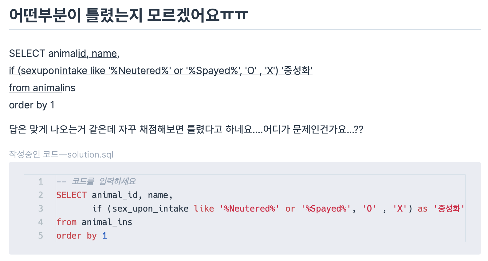

# 문제 1 (NULL 처리하기)
```
ANIMAL_INS 테이블은 동물 보호소에 들어온 동물의 정보를 담은 테이블입니다. ANIMAL_INS 테이블 구조는 다음과 같으며, ANIMAL_ID, ANIMAL_TYPE, DATETIME, INTAKE_CONDITION, NAME, SEX_UPON_INTAKE는 각각 동물의 아이디, 생물 종, 보호 시작일, 보호 시작 시 상태, 이름, 성별 및 중성화 여부를 나타냅니다.

문제
---
입양 게시판에 동물 정보를 게시하려 합니다. 동물의 생물 종, 이름, 성별 및 중성화 여부를 아이디 순으로 조회하는 SQL문을 작성해주세요. 이때 프로그래밍을 모르는 사람들은 NULL이라는 기호를 모르기 때문에, 이름이 없는 동물의 이름은 "No name"으로 표시해 주세요.
```

### 1) IFNULL()로 문제 해결
```SQL
SELECT ANIMAL_TYPE, IFNULL(NAME, 'No name'), SEX_UPON_INTAKE
FROM ANIMAL_INS
ORDER BY ANIMAL_ID
```

### 2) CASE WHEN으로 문제 해결
```SQL
SELECT ANIMAL_TYPE,
CASE WHEN NAME IS NULL
THEN 'No name'
ELSE NAME
END AS NAME,
SEX_UPON_INTAKE
FROM ANIMAL_INS
ORDER BY ANIMAL_ID
```

# 문제 2 (중성화 여부 판단하기)
```
ANIMAL_INS 테이블은 동물 보호소에 들어온 동물의 정보를 담은 테이블입니다. ANIMAL_INS 테이블 구조는 다음과 같으며, ANIMAL_ID, ANIMAL_TYPE, DATETIME, INTAKE_CONDITION, NAME, SEX_UPON_INTAKE는 각각 동물의 아이디, 생물 종, 보호 시작일, 보호 시작 시 상태, 이름, 성별 및 중성화 여부를 나타냅니다.

문제
---
보호소의 동물이 중성화되었는지 아닌지 파악하려 합니다. 중성화된 동물은 SEX_UPON_INTAKE 컬럼에 'Neutered' 또는 'Spayed'라는 단어가 들어있습니다. 동물의 아이디와 이름, 중성화 여부를 아이디 순으로 조회하는 SQL문을 작성해주세요. 이때 중성화가 되어있다면 'O', 아니라면 'X'라고 표시해주세요.
```

### 3) 문제 해결
```SQL
SELECT ANIMAL_ID, NAME,
CASE WHEN SEX_UPON_INTAKE LIKE '%Neutered%' or SEX_UPON_INTAKE LIKE '%Spayed%'
THEN 'O'
ELSE 'X'
END AS 중성화
FROM ANIMAL_INS
ORDER BY ANIMAL_ID
```
CASE WHEN 구문을 사용하여 SEX_UPON_INTAKE 칼럼에 'Neutered' 또는 'Spayed'라는 단어가 포함되었는지 조건문으로 나누었습니다.

### 4) 오류 찾기



```SQL
IF(SEX_UPON_INTAKE LIKE '%Neutered%' OR '%Spayed%', 'O' , 'X')
```
- 이 코드에서 or '%Spayed%' 부분에서 오류가 발생했습니다. or 연산자는 두 개의 완전한 조건을 연결해야 합니다. '%Spayed%'는 단독으로 조건이 될 수 없습니다.
- 즉, or 연산자를 이용하여 두 개의 조건을 연결하기 위해서는 다음과 같이 코드를 작성해야합니다,

```SQL
IF(SEX_UPON_INTAKE LIKE '%Neutered%' OR SEX_UPON_INTAKE LIKE '%Spayed%', 'O', 'X')
```