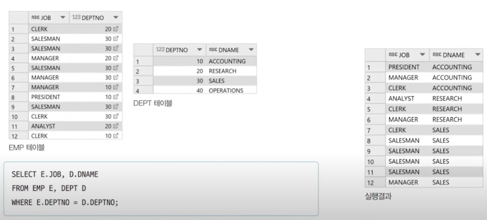
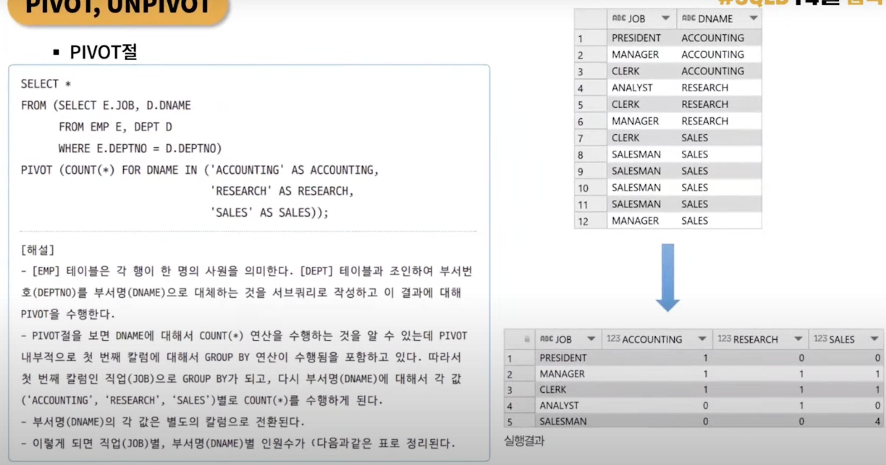
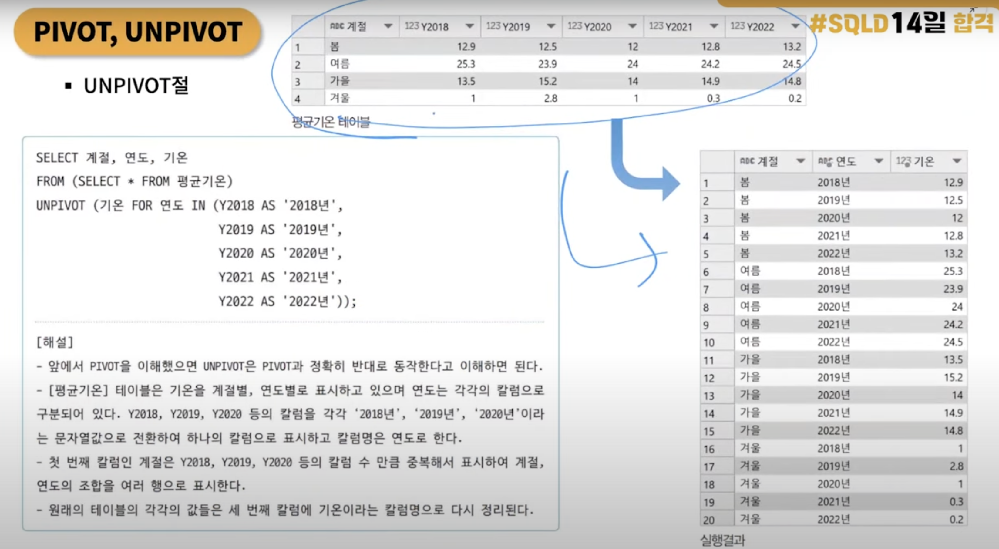

# 1. PIVOT과 UNPIVOT

## 학습 요약
- 가시성이 확보된 데이터 형태와 집계함수를 사용할 수 있는 데이터 형태는 구분되어 있음
- 이 두 가지 데이터 형태를 변경하기 위해 사용하는 함수

---

- 칼럼을 기준으로 여러 개의 행으로 나뉜 데이터를 행과 열을 전환해 테이블을 재구성하여 보기 편하도록 만드는 것

- PIVOT : 행을 열로 바꾼다, 지정된 칼럼의 각 행 속성값들이 새로운 칼럼 헤더가 되고 이에 맞게 전체 속성값들이 재배치된다.

- UNPIVOT : PIVOT과 반대로 열을 행으로 바꾼다. 칼럼 헤더들이 한 칼럼의 각 행 속성값이 되고 이에 맞게 전체 속성값들이 재배치된다.

---



- 실행 결과 데이터 형태는 GROUP BY 와 같은 집계하수는 사용하기는 편하지만 가시성이 부족함



- 이와 같이 PIVOT을 활용하면 가시성이 확보된 데이터 형태로 변환됨

- 행을 열로 바꾸지만 전치 행렬과는 다른 개념



- UNPIVOT은 정확히 반대 개념

---

## 문제 풀이

```
Pivot the Occupation column in OCCUPATIONS so that each Name is sorted alphabetically and displayed underneath its corresponding Occupation. The output column headers should be Doctor, Professor, Singer, and Actor, respectively.
Note: Print NULL when there are no more names corresponding to an occupation.

Occupation will only contain one of the following values: Doctor, Professor, Singer or Actor.

Explanation
The first column is an alphabetically ordered list of Doctor names.
The second column is an alphabetically ordered list of Professor names.
The third column is an alphabetically ordered list of Singer names.
The fourth column is an alphabetically ordered list of Actor names.
The empty cell data for columns with less than the maximum number of names per occupation (in this case, the Professor and Actor columns) are filled with NULL values.
```

```
문제

OCCUPATIONS 테이블에서 Occupation 열을 피벗(Pivot)하여, 각 Name이 알파벳 순으로 정렬된 상태로 해당하는 직업(Occupation) 아래에 표시되도록 합니다. 출력 열의 헤더는 각각 Doctor, Professor, Singer, Actor가 되어야 합니다.

조건

특정 직업에 해당하는 이름이 없는 경우, 빈 셀 대신 “NULL”을 출력합니다.
Occupation 열은 “Doctor”, “Professor”, “Singer”, “Actor” 중 하나만 포함합니다.

출력 형식 설명

첫 번째 열(Doctor)에는 알파벳 순으로 정렬된 Doctor의 이름 목록이 표시됩니다.
두 번째 열(Professor)에는 알파벳 순으로 정렬된 Professor의 이름 목록이 표시됩니다.
세 번째 열(Singer)에는 알파벳 순으로 정렬된 Singer의 이름 목록이 표시됩니다.
네 번째 열(Actor)에는 알파벳 순으로 정렬된 Actor의 이름 목록이 표시됩니다.
어떤 열이라도 직업별 최대 이름 수보다 적은 경우, 해당 열의 나머지 행은 “NULL”로 채웁니다.
```

# 2. 성능 최적화 기법

## 칼럼 요약

쿼리 최적화 팁 6가지

**0. 인덱싱**
- 인덱싱 : 데이터베이스에서 원하는 정보를 찾기 위한 "지름길"을 만드는 것

- 데이터 검색 속도가 크게 향상되고, 데이터를 효율적으로 관리하고 활용하는 데 큰 도움이 됨

---

**1. 좌변을 연산하지 않을 것**

```SQL
SELECT * FROM sales WHERE YEAR(date) = 2021;
```

- 직관적이고 이해하기 쉬운 코드이지만 데이터베이스 관점에서는 효율적이지 않음

- 한 줄 한 줄 일일이 YEAR(date) 연산을 수행하고, 그 결과가 2021인지 확인하는 작업이 계속되므로 데이터가 많을수록 작업량이 엄청남

- 우변에서의 데이터 필터링이 필수적

```SQL
SELECT * FROM sales 
WHERE date >= '2021-01-01' AND date <= '2021-12-31';
```

- data 컬럼을 그대로 사용하고 있음 

- 이처럼 원본 데이터를 직접 비교하는 조건을 사용하는 것이 인덱스를 최대한 활용하고 쿼리 성능을 높이는 비결

---

**2. OR 대신 UNION을 사용할 것**

```SQL
SELECT * FROM employees 
WHERE department = 'Marketing' OR department = 'IT';
```

- OR 연산자를 사용하면 데이터베이스는 한 번의 스캔으로 모든 조건을 확인해야 함

- 인덱스의 장점인 단일 값에 대한 빠른 검색의 최적화를 할 수 없음

```SQL
SELECT * FROM employees WHERE department = 'Marketing'
UNION
SELECT * FROM employees WHERE department = 'IT';
```

- department = 'Marketing'와 department = 'IT'는 각각 인덱스를 통해 빠르게 처리될 수 있음

- 만약 중복이 없다는 게 확실하다면 UNION ALL을 사용해 중복 제거 단계를 건너뛰고 성능을 더 높일 수 있음

---

**3. 필요한 Row와 Column만 선택하여 성능 최적화하기**

- 특정 조건을 만족하는 Row만 선택하기

    ```SQL
    SELECT name, email
    FROM employees
    WHERE department = 'Marketing' AND sales >= 100000;
    ```

- 서브쿼리를 활용하여 필요한 데이터만 추출하기

    ```SQL
    SELECT e.name, e.department, e.sales
    FROM employees e
    JOIN (
    SELECT department, MAX(sales) AS max_sales
    FROM employees
    GROUP BY department
    ) d ON e.department = d.department AND e.sales = d.max_sales;
    ```

    - 서브쿼리에서 불필요한 Column을 제외하고 오직 department와 max_sales만 선택

---

**4. 분석 함수를 활용하여 쿼리 성능 높이기**

- 분석 함수(Analytic Functions)는 SQL 쿼리의 성능을 한 단계 높이는 강력한 도구

- 쿼리 효율성을 높이는 분석 함수

    - 전통적인 집계 함수와 달리 사전에 데이터를 그룹화할 필요가 없음

    - 중간 결과물의 저장과 재처리를 최소화할 수 있음

- 순위 결정 함수로 데이터 순서 매기기

    ```SQL
    SELECT 
  name, 
  department, 
  salary,
  ROW_NUMBER() OVER (PARTITION BY department ORDER BY salary DESC) AS rank
  FROM employees;
    ```

    - RANK()와 DENSE_RANK() 함수도 비슷한 방식으로 동작하지만, 동일한 값에 대해 동일 순위를 부여한다는 점이 다름

- 데이터 변화를 추적하는 분석 함수

    ```SQL
    SELECT
  name,
  salary,
  LAG(salary) OVER (PARTITION BY department ORDER BY hire_date) AS prev_salary,
  salary - LAG(salary) OVER (PARTITION BY department ORDER BY hire_date) AS salary_increase
    FROM employees;
    ```

    - 시계열 데이터나 연속적인 데이터 집합을 다룰 때, 이전 데이터 포인트와의 비교가 필요한 분석에 아주 유용하게 활용됨

- 분석 함수로 데이터 필터링 최적화하기

    ```SQL
    WITH ranked_employees AS (
  SELECT 
    name, 
    department, 
    salary,
    ROW_NUMBER() OVER (PARTITION BY department ORDER BY salary DESC) AS rank
  FROM employees
    )
    SELECT *
    FROM ranked_employees
    WHERE rank <= 3;
    ```

    - 전체 데이터를 먼저 스캔하지 않고도 필요한 결과만 빠르게 필터링할 수 있음

---

**5. 와일드카드(%)는 끝에 작성하는 것이 더 좋다**

- SQL에서 LIKE 연산자와 함께 와일드카드(%)를 사용하면 텍스트 데이터를 유연하게 검색할 수 있음

- 와일드카드의 위치에 따라 쿼리 성능이 크게 달라질 수 있음

- 와일드카드의 위치가 중요한 이유

    ```SQL
    SELECT * FROM users WHERE name LIKE '%John';
    ```

    - 와일드카드가 앞에 있으면, 데이터베이스가 'John'으로 끝나는 모든 가능한 문자열 조합을 일일이 검색해야 함

    - 인덱스가 있어도 제대로 활용할 수 없고 쿼리 속도는 느려지게 됨

    ```SQL
    SELECT * FROM users WHERE name LIKE 'John%';
    ```

    - 데이터베이스가 인덱스를 활용해서 검색 범위를 효과적으로 좁힐 수 있음

---

**6. 계산값을 미리 저장해두었다가, 나중에 조회할 것**

- 실시간 계산의 비효율성

    ```SQL
    SELECT 
    p.product_id,
    AVG(od.quantity * od.unit_price) AS avg_order_amount,
    SUM(od.quantity * od.unit_price) AS total_sales,
    COUNT(DISTINCT o.customer_id) AS num_purchasers,
    COUNT(DISTINCT CASE WHEN o.customer_id IN (
        SELECT customer_id 
        FROM orders
        WHERE product_id = p.product_id
        GROUP BY customer_id
        HAVING COUNT(*) > 1
    ) THEN o.customer_id END) * 1.0 / COUNT(DISTINCT o.customer_id) AS repurchase_rate
    FROM 
        products p
        JOIN order_details od ON p.product_id = od.product_id
        JOIN orders o ON od.order_id = o.order_id
    GROUP BY 
        p.product_id;
    ```

    - 이 쿼리가 실행될 때마다 방대한 양의 주문 및 고객 데이터를 모두 읽어서 복잡한 계산을 수행해야 함

- 계산값을 저장하고 활용하기

    ```SQL
    CREATE TABLE product_stats AS
    SELECT
        p.product_id,
        AVG(od.quantity * od.unit_price) AS avg_order_amount,
        SUM(od.quantity * od.unit_price) AS total_sales,
        COUNT(DISTINCT o.customer_id) AS num_purchasers,
        COUNT(DISTINCT CASE WHEN o.customer_id IN (
            SELECT customer_id
            FROM orders
            WHERE product_id = p.product_id
            GROUP BY customer_id
            HAVING COUNT(*) > 1
    ) THEN o.customer_id END) * 1.0 / COUNT(DISTINCT o.customer_id) AS repurchase_rate
    FROM
        products p
        JOIN order_details od ON p.product_id = od.product_id
        JOIN orders o ON od.order_id = o.order_id
    GROUP BY
        p.product_id;
    ```

    - product_stats라는 새 테이블을 만들고, 앞서 본 복잡한 계산을 수행하여 각 상품의 통계치를 미리 저장함

- 주기적인 계산 결과 업데이트

    ```SQL
    UPDATE product_stats ps
    SET
        avg_order_amount = (
            SELECT AVG(od.quantity * od.unit_price)
            FROM order_details od
            WHERE od.product_id = ps.product_id
        ),
        total_sales = (
            SELECT SUM(od.quantity * od.unit_price)
            FROM order_details od
            WHERE od.product_id = ps.product_id  
        ),
        num_purchasers = (
            SELECT COUNT(DISTINCT o.customer_id)
            FROM order_details od
            JOIN orders o ON od.order_id = o.order_id
            WHERE od.product_id = ps.product_id
        ),
        repurchase_rate = (
            SELECT 
                COUNT(DISTINCT CASE WHEN o.customer_id IN (
                    SELECT customer_id
                    FROM orders
                    WHERE product_id = ps.product_id
                    GROUP BY customer_id
                    HAVING COUNT(*) > 1
                ) THEN o.customer_id END) * 1.0 / COUNT(DISTINCT o.customer_id)
            FROM order_details od 
            JOIN orders o ON od.order_id = o.order_id
            WHERE od.product_id = ps.product_id
        );
    ```

    - product_stats 테이블의 통계치들을 최신 주문 내역을 바탕으로 업데이트하는 쿼리

    - 이런 식으로 계산 결과를 저장하고 주기적으로 업데이트하면, 복잡한 실시간 쿼리의 부담을 크게 줄일 수 있음